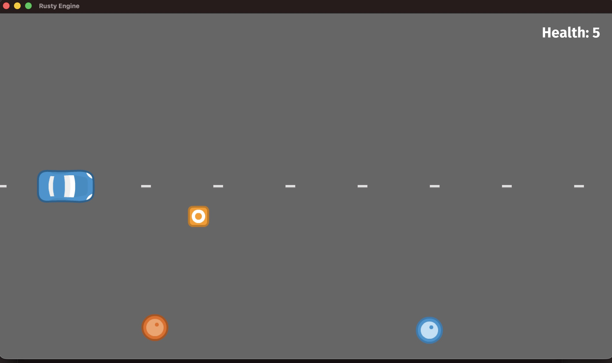

# Rust Intermediate Concepts

A workspace of standalone Rust crates for practicing intermediate-level Rust: ownership patterns, traits, error handling, concurrency, and a couple of small games built with [Rusty Engine](https://github.com/CleanCut/rusty_engine).

## Layout

| Path                      | What it is                                                                                                                                                    |
| ------------------------- | ------------------------------------------------------------------------------------------------------------------------------------------------------------- |
| [`road_race/`](road_race) | **Main project** — a top-down dodging/racing game. See below.                                                                                                 |
| `car_shoot/`              | A shooting-gallery game (car spawns marbles to shoot approaching cars).                                                                                       |
| `game/`                   | Early Rusty Engine exploration/tutorial sandbox.                                                                                                              |
| `examples/`               | Small focused programs by topic: closures, iterators, traits, errors, logging, multithreading, channels, benchmarking, unit/integration tests, a puzzle game. |
| `exercises/`              | Practice exercises by topic: traits, errors, idiomatic Rust, closures/iterators, threads/channels, logging, testing, docs.                                    |

Each subdirectory (`road_race`, `car_shoot`, `game`) is its own Cargo crate — `cd` into one and `cargo run`.

## Road Race

The main project here: a 2D top-down racing/dodging game.

Drive a car locked to the left side of the screen while the road scrolls past. Obstacles (barrels, cones) approach from the right — dodge them by moving up and down. Hit one and you lose health; drive off the top or bottom of the road and it's instant game over.

- **Move:** `↑` / `↓` arrow keys
- **Health:** starts at 5, shown top-right
- **Lose condition:** health reaches 0, or you drive off the road

### Running it

```bash
cd road_race
cargo run
```

### How it works

#### How it looks



- `src/main.rs` sets up the player sprite, scrolling road-line sprites, and a handful of obstacle sprites, then hands a custom `GameState` resource (`health_amount`, `lost`) to `game.run(...)`.
- `game_logic` runs every frame: reads arrow-key input to move the player, scrolls road lines and obstacles left each frame, and wraps/respawns each one (at a new random position) once it scrolls off-screen — no despawn/respawn allocation needed.
- Collisions are drained from `engine.collision_events` each frame; only events involving `player1` (and not collision-end events) reduce health and play an impact sound.
- Hitting 0 health stops the music, plays a losing jingle, and displays a "Game Over" text sprite.
